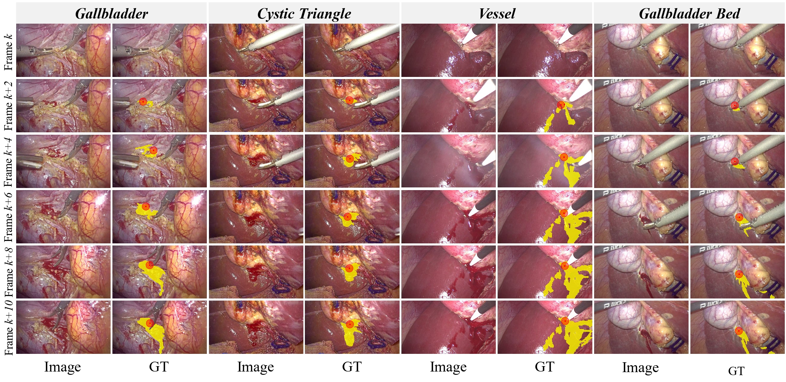
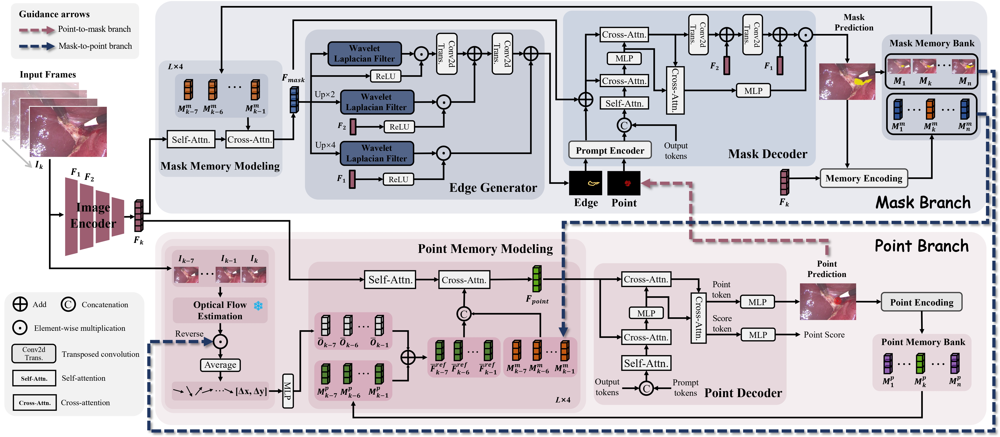
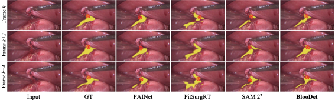

<h1 align="center">Synergistic Bleeding Region and Point Detection in <br>
Laparoscopic Surgical Videos [CVPR 2026]</h1>

<div align='center'>
    <a href='https://scholar.google.com/citations?user=1lPivLsAAAAJ&hl=en' target='_blank'><strong>Jialun Pei</strong></a><sup> 1</sup>,&thinsp;
    <a href='https://scholar.google.com/citations?hl=zh-CN&user=lvx5k9cAAAAJ' target='_blank'><strong>Zhangjun Zhou</strong></a><sup> 2</sup>,&thinsp;
    <a href='https://scholar.google.com.hk/citations?user=yXycwhIAAAAJ&hl=zh-CN&oi=sra' target='_blank'><strong>Diandian Guo</strong></a><sup> 1</sup>,&thinsp;
    <a href='https://scholar.google.com/citations?user=1lPivLsAAAAJ&hl=en' target='_blank'><strong>Zhixi Li</strong></a><sup> 2,3</sup>,&thinsp;
  <a href='https://harry-qinjing.github.io/' target='_blank'><strong>Jing Qin</strong></a><sup> 2</sup>,&thinsp;
    <a href='https://scholar.google.com/citations?user=Shy1gnMAAAAJ&hl=en' target='_blank'><strong>Bo Du</strong></a><sup> 4*</sup>,&thinsp;
    <a href='https://scholar.google.com.hk/citations?user=OFdytjoAAAAJ&hl=zh-CN&oi=sra' target='_blank'><strong>Pheng-Ann Heng</strong></a><sup> 1</sup>
</div>

<div align='center'>
   <sup>1 </sup>The Chinese University of Hong Kong&ensp; <sup>2 </sup>The Hong Kong Polytechnic University&ensp;  
    <br />
    <sup>3 </sup>Southern Medical University&ensp;  <sup>4 </sup>Wuhan University&ensp;  
</div>

<div align="center" style="display: flex; justify-content: center; flex-wrap: wrap;">
  <a href='https://arxiv.org/abs/2503.22174'></a>&ensp; 
  <a href='https://arxiv.org/abs/2503.22174'></a>&ensp; 
  <a href='https://youtu.be/wueRsI2lZjU'></a>&ensp; 
  <a href='LICENSE'></a>&ensp; 
  <!--
  <a href=''></a>&ensp; 
  <a href=''></a>&ensp; 
  -->
  
</div>

<div align="center">
  <a href="https://youtu.be/wueRsI2lZjU"><strong>Watch the full BlooDet demo on YouTube</strong></a>
</div>

<div align="center">
  <a href="https://youtu.be/wueRsI2lZjU">
    
  </a>
</div>

This repo is the official implementation of "[**Synergistic Bleeding Region and Point Detection in Laparoscopic Surgical Videos**](https://arxiv.org/abs/2503.22174)".

**Contact:** peijialun@gmail.com


<!--
# [CVPR][2026] SurgBlood
Official Implementation of CVPR2026 paper "Synergistic Bleeding Region and Point Detection in Laparoscopic Surgical Videos".
-->


## Environment preparation

### Requirements
- **Please refer to [SAM2](https://github.com/facebookresearch/sam2).**
- You may need to install Apex using pip.

## Dataset preparation :fire:
### Download the datasets and annotation files

- SurgBlood: Coming by June 2026.

 ### Register datasets
1. Download the datasets and put them in the same folder. To match the folder names in the dataset mappers, it is better not to rename them. The structure should be:
```
    DATASET_ROOT/
    ├── SurgBlood
       ├── train
            ├── videos-image
            ├── videos-mask
            ├── videos-mask-edge
            ├── videos-point
       ├── test
            ├── videos-image
            ├── videos-mask
            ├── videos-point
```
2. For convenience, we provide a test dataset folder containing four types of bleeding:


<div align="center">
  
</div>


## Pre-trained models:
- Download the pre-training weights of sam2_base: **[sam2_hiera_base_plus](https://dl.fbaipublicfiles.com/segment_anything_2/072824/sam2_hiera_base_plus.pt).** 
- Download the pre-trained weights on SurgBlood: **[Google](https://drive.google.com/file/d/1Xw3Px0w2KVKY6IzzdY6fRjjHRLiI5is-/view?usp=sharing).**

<div align="center">
  
</div>


## Usage
### Train&Test
- To train and evaluate BlooDet on a single GPU, run the following command. The trained models will be saved in the `savePath` folder. You can modify `datapath` if you want to use your own datasets.
```shell
bash trainAndEvaluate.sh
```
- Alternatively, to test or evaluate BlooDet on SurgBlood:
```shell
python test.py
bash evaluate.sh

```
<!--
## Acknowledgement
-->

[//]: # (This work is based on:)
[//]: # (- [SAM2]&#40;https://github.com/facebookresearch/sam2;)
[//]: # ()
[//]: # (Thanks for their great work!)


## Visualization results &#x26A1;
The visual results of **SOTAs** on **SurgBlood test set**: **[Google](https://drive.google.com/file/d/1XrC6q8BftPLTIq8gLe7YT0uyQbWqRmxI/view?usp=sharing).**

<div align="center">
  <a href="assets/Visual_Comp.pdf">
    
  </a>
</div>


## Citation

If this helps you, please cite this work:

```
@misc{pei2025synergisticbleedingregionpoint,
      title={Synergistic Bleeding Region and Point Detection in Laparoscopic Surgical Videos}, 
      author={Jialun Pei and Zhangjun Zhou and Diandian Guo and Zhixi Li and Jing Qin and Bo Du and Pheng-Ann Heng},
      year={2025},
      eprint={2503.22174},
      archivePrefix={arXiv},
      primaryClass={cs.CV},
      url={https://arxiv.org/abs/2503.22174}, 
}
```
